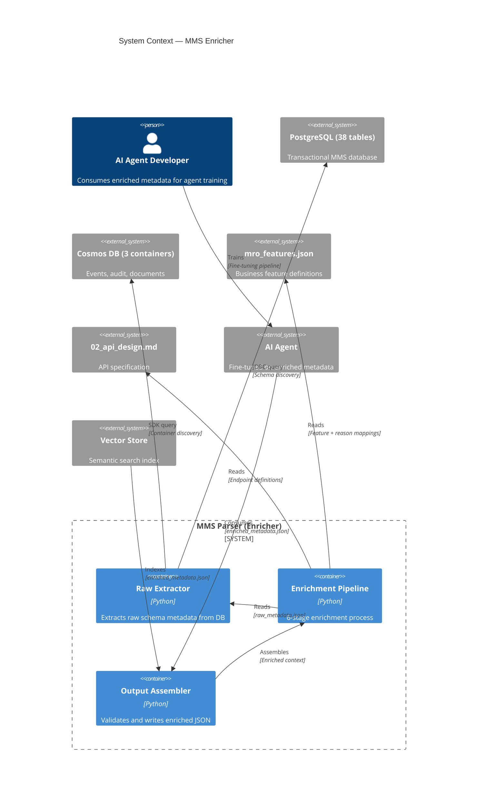
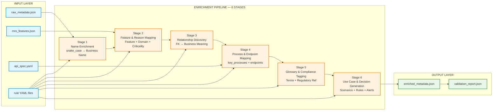
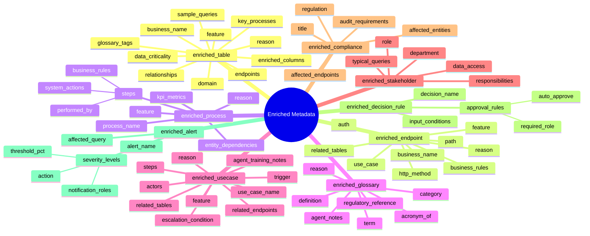
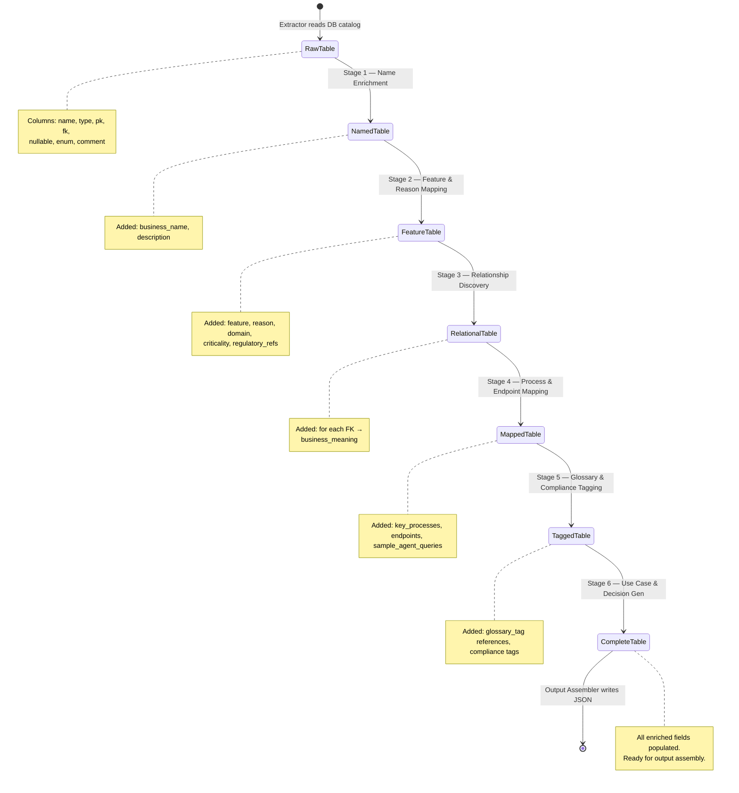
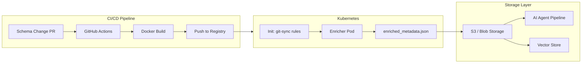
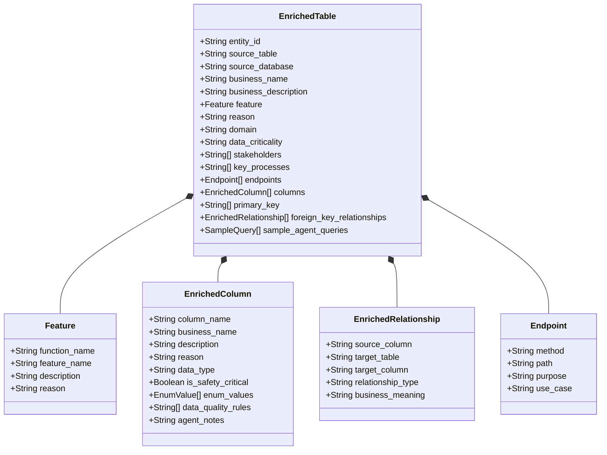

# enricher_pipeline_diagram.md
# Copy this file content into: https://mermaid.live/ OR any Mermaid renderer

## C4 Context Diagram (Level 1)



## 6-Stage Pipeline Detail



## Enriched JSON Entity Types



## Data Flow Per Entity



## Rule Engine Flow

```mermaid
flowchart TD
    subgraph RuleEngine[RULE ENGINE]
        RE[RuleEngine.match()]:::rule
        R1{Exact match?}:::decision
        R2{Regex match?}:::decision
        R3{Wildcard match?}:::decision
        Default[Use default value]:::default
        Result[Return matched rule]:::result
    end

    Input[Raw name: life_limited_part] --> RE
    RE --> R1
    R1 -- Yes --> Result
    R1 -- No --> R2
    R2 -- Yes --> Result
    R2 -- No --> R3
    R3 -- Yes --> Result
    R3 -- No --> Default

    classDef rule fill:#e3f2fd,stroke:#1976d2,stroke-width:2px
    classDef decision fill:#fff3e0,stroke:#f57c00,stroke-width:2px
    classDef default fill:#fce4ec,stroke:#c62828,stroke-width:2px
    classDef result fill:#e8f5e9,stroke:#388e3c,stroke-width:2px
```

## Deployment Architecture



## Single enriched_table JSON Structure


