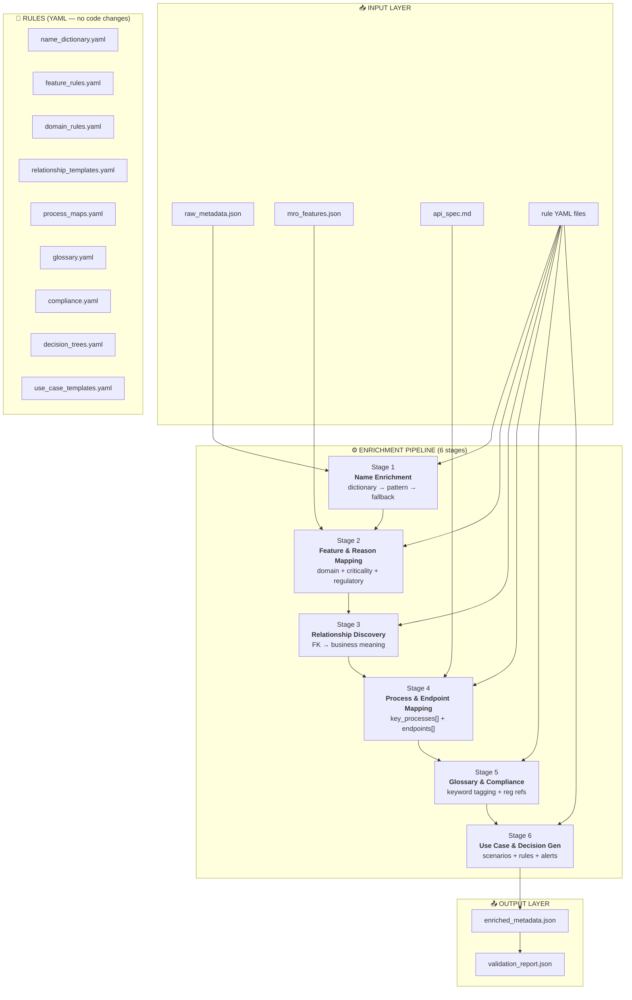

# MMS Enricher — Implementation Plan

## Enricher Pipeline Diagram



---

## Module Structure

```
enricher/
├── main.py                          # CLI entrypoint — mode selection
├── pipeline.py                      # PipelineOrchestrator — sequential DAG runner
├── config.yaml                      # Execution config
│
├── input/
│   ├── raw_metadata_loader.py       # Reads raw_metadata.json
│   ├── features_loader.py           # Reads mro_features.json
│   ├── api_spec_loader.py           # Parses API spec
│   └── rule_loader.py               # Loads all YAML rule files
│
├── stages/
│   ├── stage1_name_enrichment.py
│   ├── stage2_feature_mapping.py
│   ├── stage3_relationship.py
│   ├── stage4_process_map.py
│   ├── stage5_glossary.py
│   └── stage6_usecase_gen.py
│
├── rules/                           # All YAML — add without deploying
│   ├── name_dictionary.yaml         #   ✅ exists (10 tables)
│   ├── feature_rules.yaml           #   ❓
│   ├── domain_rules.yaml            #   ❓
│   ├── relationship_templates.yaml  #   ❓
│   ├── process_maps.yaml            #   ❓
│   ├── glossary.yaml                #   ❓
│   ├── compliance.yaml              #   ❓
│   ├── decision_trees.yaml          #   ❓
│   └── use_case_templates.yaml      #   ❓
│
├── output/
│   ├── enriched_assembler.py        # Assemble final JSON
│   ├── enriched_validator.py        # Validate against schema
│   └── enriched_exporter.py         # Format variants
│
├── shared/
│   ├── models.py                    # Pydantic v2 models (11 entity types)
│   ├── enrichment_context.py        # Shared context, mutated per stage
│   ├── error_handler.py             # Non-fatal warning collection
│   └── logger.py                    # structlog → JSON
│
└── tests/
    ├── test_pipeline.py
    ├── test_stage1.py .. test_stage6.py
    ├── fixtures/
    └── mock_rules/
```

---

## Core Classes

```python
class EnrichmentContext:
    """Shared context — each stage reads and mutates in place."""
    raw_metadata: RawMetadata
    enriched_tables: list[EnrichedTable]
    enriched_endpoints: list[EnrichedEndpoint]
    enriched_relationships: list[EnrichedRelationship]
    enriched_processes: list[EnrichedProcess]
    enriched_glossary: list[EnrichedGlossary]
    enriched_usecases: list[EnrichedUseCase]
    enriched_decisions: list[EnrichedDecisionRule]
    enriched_alerts: list[EnrichedAlert]
    enriched_compliance: list[EnrichedCompliance]
    enriched_stakeholders: list[EnrichedStakeholder]
    errors: list[EnrichmentError]
    pipeline_meta: PipelineMetadata


class EnrichmentStage(ABC):
    stage_id: str
    dependencies: list[str]

    @abstractmethod
    def execute(self, context: EnrichmentContext) -> None: ...


class RuleEngine:
    """Pattern matcher: exact → regex → wildcard → None (+log warn)."""
    def match(self, input_name: str) -> Rule | None: ...


class PipelineOrchestrator:
    """Sequential DAG — stages execute in dependency order."""
    def run(self, context: EnrichmentContext) -> EnrichmentContext: ...
```

---

## Stage Logic (summary)

| Stage | What it adds | How |
|-------|-------------|-----|
| **1 — Name Enrichment** | `business_name`, `description` on every column | Dictionary lookup → regex pattern → Title Case fallback |
| **2 — Feature Mapping** | `feature`, `reason`, `domain`, `criticality`, `regulatory_refs` | Match `feature_rules.yaml`; evaluate criticality rules (safety-related → `safety_critical`, etc.) |
| **3 — Relationships** | `business_meaning` per FK | Template: *"A {source} belongs to one {target}"* |
| **4 — Process Mapping** | `key_processes[]`, `endpoints[]` | Cross-reference `process_maps.yaml` + API spec by table involvement |
| **5 — Glossary** | `glossary_tags[]`, `compliance_tags[]` | Keyword match `glossary.yaml` + `compliance.yaml` against names/descriptions |
| **6 — Use Cases** | `usecase[]`, `decision_rule[]`, `alert[]` | Template instantiation from `use_case_templates.yaml` based on matched tables |

---

## Execution Modes (CLI)

| Mode | Trigger | Scope | SLA |
|------|---------|-------|-----|
| `full` | Schema change / monthly | All 38 tables | < 5 min |
| `incremental` | New table added | Single table | < 30 s |
| `rule-only` | Rule YAML changed | Re-run with cached input | < 30 s |
| `validate` | PR created | Dry-run + diff report | < 2 min |

---

## Tech Stack

| Component | Choice |
|-----------|--------|
| Language | Python 3.12+ |
| Data models | Pydantic v2 |
| Pipeline orchestration | Simple sequential (Prefect/Airflow if needed later) |
| Configuration | YAML |
| Testing | pytest + factory_boy |
| Logging | structlog → JSON |
| Validation | JSON Schema (Draft 2020-12) |
| Container | Docker |
| CI/CD | GitHub Actions |

---

## Key Design Decisions

1. **Rule-based, not LLM-based** — deterministic, auditable, version-controllable
2. **YAML rules, not code** — domain SMEs edit without engineering; no deploy needed
3. **Python, not Java** — batch transform pipeline, not a transactional API; Pydantic + YAML ecosystem fits better
4. **Sequential stages** — each depends on the previous; 38 tables don't need parallelism
5. **Warnings never halt** — missing rule for one table doesn't block the other 37
6. **Single JSON artifact** — `enriched_metadata.json` with 11 entity sections, consumed directly by AI agent pipelines
